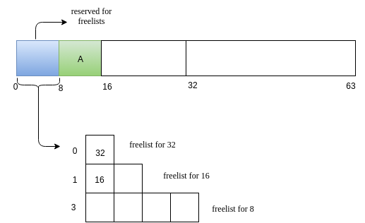
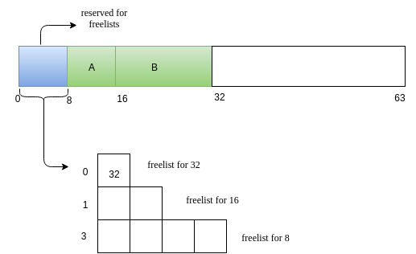
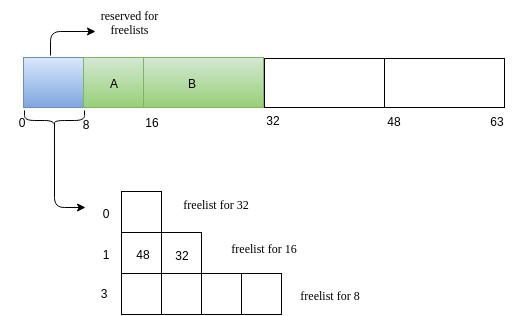
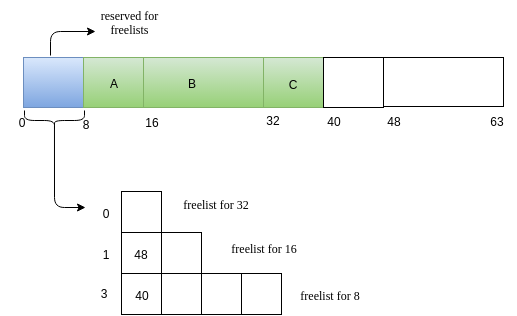

Data Structures    

*   [Home](index.html)
*   [About](about.html)
*   [Roadmap](roadmap.html)
*   [Documentation](documentation.html)

* * *

Data Structures for ExpL Compilation/Interpretation

  
  

*   [Introduction](#nav-introduction)
*   [Data Structures for Analysis Phase](#nav-analysis-structures)
*   [Type Table](#nav-typetable)
*   [Symbol Table](#nav-symbol-table)
*   [Global Symbol Table](#nav-global-symbol-table)
*   [Local Symbol Table](#nav-local-symbol-table)
*   [Abstract Syntax Tree](#nav-abstract-syntax-tree)
*   [Data Structures for execution phase](#nav-execution-structures)
*   [The memory model](#nav-memory-model)
*   [Register Allocation](#nav-register-allocation)
*   [Static Allocation](#nav-static-allocation)
*   [Run Time Stack Allocation](#nav-run-time-stack)
*   [Heap Allocation](#nav-heap)

INTRODUCTION
------------

The compilation/interpretation of an ExpL program involves two phases. In the first phase (called the **analysis phase**), the source ExpL program is analyzed (lexical, syntax and semantic analysis are completed in this phase) and if the program is free of syntax and semantic errors, an intermediate representation of the source program called the **abstract syntax tree** is generated. 

This is followed by a second phase, whose functionality is different for a compiler and an interpreter.

In the case of a compiler, the second phase (called the **synthesis phase**) recursively traverses the abstract syntax tree and generates target code. 

\[**Note**: the abstract syntax tree representation is only one among several intermediete representations used in practical compilers. “Lower level” intermediete representations like three address code are often more useful for applying code optimization algorithms. In our present experiment, we do not perform any code optimizations and hence the code generation phase will directly work with the abstract syntax tree.\]

In the case of interpretation, the second phase (called the execution phase) involves direct execution of the program by recursive evaluation of the abstract syntax tree. 

_The description of data structures below assumes an interpreter is being designed_. This choice has been made to avoid target machine dependency in the documentation.  Notes/comments  are added wherever appropriate explaining the modifications to be made to the data structures to implement a compiler.

There are three basic data structures that are maintained during the analysis phase. These are the following:

1.  The **global symbol table** is used to store information about the global variables and functions in the program.
2.  For each function, a separate **local symbol table** is maintained to store the information about local variables and arguements of the function. 
3.  Finally, the **abstract syntax tree** that is constructed as the outcome of the analysis phase is the third data structure.

An abstract syntax tree is a tree representation of a program. It is a generalization of the tree representation for expressions (called the expression tree). For example, the arithmetic expression (3+5)\*(5+9) is typically represented as an expression tree as below:

We can generalize this representation to come up with a tree representation for the whole sequence of statements of a ExpL function in a program. Each funcion in an ExpL program will be represented by an abstract syntax tree. Thus, the whole program will be a collection of abstract syntax trees, one for each function.

In the following, the definitions node structures for each of the above data structures is discussed. The organization of data in these data structures is also discussed with illustrative examples.

DATA STRUCTURES FOR ANALYSIS PHASE
----------------------------------

Type Table
----------

The Type Table stores all the necessary information regarding the various user defined types in the source program. The compiler creates an entry in the Type Table for each user defined type. In addition to this, there are default entries created for primitive types (_int_, _str_) and special entries _null_, _boolean_ and _void_ for the internal purposes of the interpreter. The default and special entries are made beforehand whereas entries for user defined types are made as the Type Declaration Section of the source code is parsed.

#### Structure

The structure of Type Table is as follows:

The variable 'fields' is a pointer to the head of 'fieldlist'. Here 'fieldlist' stores the information regarding the different fields in the case of a user-defined type.

#### Associated Methods

*   void TypeTableCreate() : Function to initialise the type table entries with primitive types _(int,str)_ and internal data types _(boolean,null,void)_.
*   struct Typetable\* TLookup(char \*name) : Search through the type table and return pointer to type table entry of type 'name'.
*   struct Typetable\* TInstall(char \*name, struct Fieldlist \*fields) : Creates a type table entry for the type of 'name' with given 'fields' and returns the pointer to the type table entry.
*   void FInstall(char \*name, struct Typetable \*type) : Adds a fieldlist entry with given 'name' and 'type'.
*   struct Fieldlist\* FLookup(char \*name, struct Fieldlist \*list) : Searches for a field of given 'name' in the given 'fieldlist' (of some user-defined type) and returns a pointer to the matching entry.

#### Illustration

Let us consider the following sample code:

1.  The type table is first created and initialised to contain the default entries for each of the primitive and internal datatypes. This is done through a call to the function TypeTableCreate() from main function before yyparse() is called to start parsing the code. After the execution of TypeTableCreate() , the type table will be as follows:  
      
    
2.  As soon as the compiler encounters the declaration of a user defined type, it is installed into the type table. Subsequently the fields are attached to this type table entry. For instance, in the case of the user-defined type _linkedlist_, as soon as the name _linkedlist_ is encountered, a type table entry with 'name' set to _linkedlist_ and 'fields' set to _NULL_ is created. Later, on finishing the complete parse of the type definition, the fieldlist is created and it is attached to the type table entry.  
    **NOTE** : A type table entry is created as soon as the type name is seen. This is because a field of the type may be of same type (For example, just like _next_ is of type _linkedlist_ in the type definition of _linkedlist_). When the 'fieldlist' is created, the type of the field is set by looking up the type table.  
      
    
3.  Similar actions are carried out for user-defined type _marklist_ also.  
      
    
4.  Once the type declaration section is completely parsed, the type table is fully created and will not be further modified or updated.

Symbol Tables
-------------

Symbol tables are used to store information pertaining to the variables and functions in a program.

#### Global Symbol Table

The global symbol table stores information pertaining to all the global variables and functions in an ExpL program.

###### Structure

The structure of Global Symbol Table(GST) is as follows:

✛**NOTE**: In the case of a compiler, fbinding must store the starting address of the function's code in memory. A call to the function must translate into an assembly level call to the function's code in memory. Hence, in this case fbining has to be an integer storing a memory address.

Arglist is used to store information regarding the types and names of the arguements. ArgStruct has the following structure.

Read about ASTNode [here](#nav-abstract-syntax-tree).

###### Associated Methods

*   struct Gsymbol\* GInstall(char \*name,struct Typetable \*type, int size, struct ArgStruct \*arglist) : Creates a Global Symbol object of given 'name', 'type', 'size' and 'argument list' and assigns a 'binding' to the variable.
*   struct Gsymbol\* GLookup(char \*name) : Search for a GST entry with the given 'name', if exists, return pointer to GST entry else return NULL.

###### Illustration

Continuing with earlier example, let us add Global declaration section to it.

1.  As soon as the compiler encounters the global declaration of a variable or funtion, it is installed into Global Symbol Table. Subsequently, the arguments are attached to the entry in case of functions. Following is how GST looks when _studentname_ is installed. 
2.  Similarly for _rollno,average,findaverage(linkedlist marks)_, symbol table entries are formed and installed. The fbinding for a function is the abstract syntax tree of the function definition and is set only after complete parsing of the function definition.  
    
3.  After this, the types for rollno,average and findaverage will be set and these objects are appended to the global symbol table. The final Global Symbol table looks as follows:  
    

#### Local Symbol Table

In addition to the global symbol table, the ExpL compiler maintains a separate local symbol table for each function for storing information regarding the functions arguments and local variables. Each function has its own list of local variables. So each function has its own LST.

###### Structure

###### Associated methods

*   struct Lsymbol\* LInstall(char \*name,struct Typetable \*type) : Creates a local symbol tbale with given 'name' and 'type' and also sets its 'binding'.
*   struct Lsymbol\* LLookup(char \*name) : search the LST and if any entry with given 'name' is found ,return the entry,else returns NULL.

Arrays cannot be local variables, so we don't need to store the size of a variables. Also nested functions are not allowed in ExpL, so we don't require fbinding and arglist as in Gsymbol. The LST is formed for the Local Declaration Section in the same way GST was created for the Global declaration section.

Memory is allocated for local variables of a function from a seperate memory area called the [stack](#nav-stack). Hence, the binding for a local variable is the relative address of the variable with respect to the base of the [**Activation Record**](#). The [**Base Pointer**](#) points to the base of an activation record of a function. The binding is added to the Base Pointer to obtain the address of variable in stack. This will be explained in detail later.

Abstract Syntax Tree
--------------------

The machine independent **front-end** phase of a compiler constructs an intermediate representation of the source program called the **Abstract Syntax Tree (AST)**. An interpretter will evaluate the AST whereas a compiler will run a machine dependent **back-end** to generate a target assembly language program. The following structure may be used to represent a node of the AST.

The union Constant is used to store the value of an integer or sting constant.

###### Associated methods

*   struct ASTNode\* TreeCreate (  
    struct Typetable \*type,  
    int nodetype,  
    char \*name,  
    union Constant value,  
    struct ASTNode \*arglist,  
    struct ASTNode \*ptr1,  
    struct ASTNode \*ptr2,  
    struct ASTNode \*ptr3  
    )  
    Creates a node with the fields set according to the arguements passed.
*   regindex evaluate(struct ASTNode \*t)  
    Evaluation of an AST node results in a value. A compiler generates code for evaluating an AST node and assigns the result of evaluation to a register. An interpreter directly evaluates the AST node and simulates the compiler by storing the result in an array (called reg) and returning the index. We make use of the following structure to store the results of evaluation by an interpreter:
    
    In 'valstruct' the field 'valtype' can take one of the following values:
    
    1.  EMPTY : Indicates that no value is stored in it.
    2.  INT : Indicates that value stored in the union constant 'value' is an integer.
    3.  STR : Indicates the value stored in the union constant 'value' is a string.
    4.  H\_INDEX : Indicates that valstruct stores the (integer) index of a location in the heap.
    

Follwing are the nodetypes that may appear while contructing the abstract syntax free for ExpL program:

Nodetype

Description

LEAF

For interger and string constants.

ID

For all variable literals.

PLUS

For arithmetic operator '+'.  
Attributes 'ptr1' and 'ptr2' of the 'ASTNode' are set to AST of left and right operands respectively and must be of type 'int'.  
'ptr3' is set to NULL.

MINUS

For arithmetic operator '-'.  
Attributes 'ptr1' and 'ptr2' of the 'ASTNode' are set to AST of left and right operands respectively and must be of type 'int'.  
'ptr3' is set to NULL.

MUL

For arithmetic operator '\*'.  
Attributes 'ptr1' and 'ptr2' of the 'ASTNode' are set to AST of left and right operands respectively and must be of type 'int'.

DIV

For arithmetic operator '/'.  
Attributes 'ptr1' and 'ptr2' of the 'ASTNode' are set to AST of left and right operands respectively and must be of type 'int'.

GT

For relational operator '>'.  
Attributes 'ptr1' and 'ptr2' of the 'ASTNode' are set to AST of left and right operands respectively and must be of type 'int'.

LT

For relational operator '<'.  
Attributes 'ptr1' and 'ptr2' of the 'ASTNode' are set to AST of left and right operands respectively and must be of type 'int'.

GE

For relational operatot '>='.  
Attributes 'ptr1' and 'ptr2' of the 'ASTNode' are set to AST of left and right operands respectively and must be of type 'int'.

LE

For relational operatot '<='.  
Attributes 'ptr1' and 'ptr2' of the 'ASTNode' are set to AST of left and right operands respectively and must be of type 'int'.

EQ

For relational operator '=='.  
Attricutes 'ptr1' and 'ptr2' of the 'ASTNode' are set to AST of left and right operands respectively and both must be of same type.

NE

For relational operator '!='.  
Attricutes 'ptr1' and 'ptr2' of the 'ASTNode' are set to AST of left and right operands respectively and both must be of same type.

IF

For the conditional contruct 'if'.  
Attribute 'ptr1' of the 'ASTNode' is set to AST of the conditional logical expression, 'ptr2' is set to AST of list of statements that are executed when conditional expression evaluates to true and 'ptr3' is set to AST of list of statements that are to be executed when conditional expression is evalusted false.

WHILE

For conditional construct 'while'.  
Attribute 'ptr1' os 'ASTNode' is set to the conditional logical expression and 'ptr2' is set to AST of list of statements under the while construct.

READ

For input statement 'read'. Attribute 'ptr1' is set to AST of nodetype ID, which carries the information of the variable for which we are taking the input.

WRITE

For output statement 'write'. Attibute 'ptr1' is set to AST of the expression, whose value is to be written to the standard output.

ASGN

For assignment statement (<var> = <expr>).  
Attribute 'ptr1' is set to AST of nodetype ID or FIELD and 'ptr2' is set to AST of expression whose value will be assigned to lvalue given by 'ptr1'.

SLIST

To connect statements.

BODY

For body of a function.

RET

For return statement of a function.

FUNCTION

For function calls.

PARAM

For passing actual parameters during function calls.

MAIN

For main function.

FIELD

For user-defined types.

###### Illustration

Consider the following program

1\. Lets construct the abstract syntax tree step by step. The AST for conditional expression `n==1` (in line 9) will be as follows:

  
  

2\. Similarly we have AST fot `n==0` (in line 9) as follows.

  
  

3\. Next consider the complete conditional expression `n==1 || n==0`.

  
  

4.Next we will form the AST for assignment statement `f = 1` (in line 10).

  
  

5\. Next, lets consider the statement `f = n * factorial(n-1)` which consists of arthimetic expressions with operands '-','\*' and an assignment statement.

AST for `n-1` is as follows.

  
  

AST for `n * factorial(n-1)` is as follows.

  
  

AST for `f = n * factorial(n-1)` is as below.

  
  

6\. Following is the AST for the if condition.

  
  

7\. The AST for return statement is as folows

  
  

8\. Finally the AST for the factorial function will be as follows.

  
  

DATA STRUCTURES FOR EXECUTION PHASE
-----------------------------------

Before explaining the data structures used for the execution phase, it is necessary to understand the requirements and the underlying theoretical concepts in some detail.

#### The storage allocation Problem

This part of the documentation primarily focuses on program interpretation.  However, our interpreter will be somewhat mimicing the actions of a compiler and hence the reader will be able to easily adapt what is learned here to handle the synthesis phase of compilation by going through this documentation.

An interpreter needs to "execute" the abstract syntax tree and hence the interpreter must arrange storage for run time data and subroutine invocations (function calls).

A program contains global variables as well as variables that are local to functions, both requiring memory space. Of these, global variables are the simplest to handle because during the analysis phase we know how many global variables are there in the program (all global variables are declared) and how much space needs to be allocated for each of them (why?). Thus, the storage requirements of global variables are completely determined at compile time and they can be assigned memory addresses during the analysis phase itself. Such allocation is called **static allocation**. The binding field of the global symbol table entry for a variable stores a pointer (address) to the memory allocated to the variable. The symbol table information will be used during the execution phase to find out the location in memory where the variable is stored.

\[In the case of compilation, the memory addresses for each global variable in the target machine is determined during the analysis phase and are stored in the _binding_ field of the symbol table.\]

As a point aside, the binding field of the symbol table entry for a function is set to hold a _pointer to the abstract syntax tree of the function_. This helps the evaluation phase to locate the corresponding abstract syntax tree whenever a function call is encountered during the execution phase.

\[In the case of a compiler, the the analysis phase will decide on the addresses in the **code area** of memory where the function's code is loaded. The address to which a call to the function must be directed to is stored in the binding field of the symbol table.\]

Variables which are local to functions demands more complicated allocation. This is because a function may be invoked several times and _for each invocation, separate storage needs to be allocated for variables defined within the scope of the function_ (i.e., local variables and arguments).  \[Why?\] Moreover, we do not know during the analysis phase how many times a function will be invoked during the execution phase.  \[Why?\]

To understand this, consider the factorial program below.

The function factorial contains an argument n. Suppose the initial value of n input by the user at run time was 5, then factorial(n) with n=5 is invoked from the main. This function invokes factorial(n) with n=4. However, we need to retain the old value of n since the orginal factorial function must resume execution after the completion of factorial(4). Thus, we cannot statically assign a fixed memory address to the variable n. Instead, for each invocation of the function, we need to create a different memory space for storing the value of n. Moreover, the initial value of n given by the user is not known at compile time. Hence cannot determine at compile time the exact storage requirement. We will have to design the compiler/interpreter to allocate memory space as is necessary during run time.

In addition to allocating storage for local variables and arguments, additional storage needs to be allocated at run time for each invocation of a function to store the return values of the call and control information like a pointer to the next instruction in the calling function (return address)\].

The classical solution to handling function invocation is to maintain a **run time stack**. Whenever a function is invoked during execution, **an activation record** is created in the run time stack with sufficient space for storing local variables, arguments, return values and return address and the stack grows. Upon return from the function, the activation record is popped out of the stack and the activation record of the calling program will be in the top of the stack. Thus, at each point during execution, the activation record of the currently executing function will be on the top of the stack. Such storage allocation is called **stack based run time allocation**.

\[Note: The semantics of ExpL makes stack based allocation possible. Primarily, this is possible because data stored in an activation record can be forgotten once the execution of the call is finished. There are languages like LISP which permit [higher order functions](https://en.wikipedia.org/wiki/Higher-order_function) where a stack based run time allocation is not possible. Languages which permit stack based run time allocation for function invocations are said to follow **stack discipline**.\]

Observe that for each function defined in an ExpL program, the amount of storage needed in its activation record is known during the analysis phase. \[Why?\] What is not known is how many activation records will have to be created in the stack as this is known only during execution time.

In addition to allocating storage for global variables and variables local to functions, ExpL supports **dynamic memory allocation** through the alloc() function. The alloc() function allows a program to request for memory space at run time. Since the amount of memory requested is not known during the analysis phase (why?), static allocation is not possible in this case. Stack allocation also is ruled out because memory allocated by alloc() inside a function is not de-allocated when the function returns. Hence, a mechanism to dynamically allocate memory on demand at run time is required.

The classical solution to this problem is to maintain an contiguous area of memory called the heap memory from which memory is allocated by alloc() on demand. Heap management algorithms like the **fixed size allocator algorithm** and the **buddy system algorithm** are explained in detail later in this documentation.

Finally, intermediate values generated during program execution needs **temporary storage**. For example, while evaluating an expression (a+b)\*(c+d), the values of the sub-expressions (a+b) and (c+d) might need temporary storage. In a compiler, the **machine registers** are used for temporary storage. Our interpreter will simulate the compiler by having an array of “registers” for storing such temporary values. When a function invokes another function, the registers in current use will be pushed to the stack (activation record of the caller) so that the called function (callee) has the full set of registers free for its use. Upon return from the callee, the values pushed into the stack are restored to the registers before the caller resumes its execution.

To summarize, we have four kinds of memory allocation – static, stack, heap and register (temporary). The data structures and algorithms necessary for implementing each of these are discussed below.

The memory model
----------------

Our interpreter will simulate machine memory and registers by defining three memory arrays, named _stack, heap and registers_.

  
  
  

The basic unit of memory (called a **memory word**) is assumed to be able to store an integer or a string. This model is assumed because the primitive data types of ExpL are integer and string. The interpreter therefore defines the following memory structure:

The interpreter works with three arrays of memory words, to implement temporary storage (registers), the run time stack and the heap. There will be no sperarate memory array for static data. Instead, the intial part of the stack will be used for storing static data.

Register Allocation
-------------------

Register allocation is performed through two simple functions.

*   int get\_register(): Allocates a free register from the register pool reg\[16\] and returns the index of the register, returns -1 if no free register is available.
*   int free\_register(): Frees the last register that was allocated,returns 0 if success, returns -1 if the function is called with none of the registers being allocated.

The interpreter invokes these functions in the course of evalaution of expressions to create temporary store.

Static Allocation
-----------------

As noted previously, global variables are allocated statically. In our interpreter, the initial portion of the stack will be used for static allocation. The rest of the stack memory region will be used for run time allocation. The amount of static storage required is known from the variable declarations.

Run Time Stack Allocation
-------------------------

During run-time, when an ExpL function is invoked, space has to be allocated for storing

*   the arguments to the function,
*   return value of the function,
*   local variables declared in the function.

For this, an **activation record** is created in the stack for each function call (and the stack grows). The activation record is also used to save the state (registers in use) of the invoking function and some control information (like the return address of the calling program in the case of a compiler).

Each activation record has a base, and the **base pointer (BP)** is a variable (or a machine register in the case of a compiler) that points to the base of the current functions activation record. When one function invokes another, the base pointer value of the caller is pushed on to the stack and BP is set to point to the new activation record base. Upon return, the activation record is popped off the stack and old value of base pointer is restored. The **stack pointer (SP)** points to the top of the stack.

The **calling convension** fixes in what order arguments to a function must be pushed by the caller to the called function, the place in the activation record where the return value is expected to be written by the callee etc. The structure of the activation record explained below will clarify the calling convension.

When a function is invoked, a part of the activation record is set up by the caller and the rest is set up after invocation of the function. Similarly, when a function returns, the callee and the caller are responsible for removing the parts they have set up.

The following sequence of actions occur when a function A calls another function B.

1.  A pushes its machine state (registers in use) into the stack so that the registers are free for use in B.
2.  A pushes to arguments to B in the order they appear in the declaration.
3.  A pushes one empty space in the stack for B to place its return value.
4.  A invokes B. (In the case of a compiler, this results in generation of a CALL instruction which results in pushing the instruction pointer into the stack and transfer of control to B).

Inside B, the following space allocations take place:

5.  B saves the BP value of A to the stack and sets its own BP to the location where the BP of A is stored.
6.  B allocates space for local variables (in the order in which they appear in the delcaration.

This completes the activation record for B. If B later calls another function C, then it starts saving its registers, pushes arguments to C and so on.

When B completes execution the following sequence of actions take place:

1.  B pops out the local variables.
2.  The old BP value is popped off and saved into BP.
3.  B returns (in the case of a compiler, this results in generation of a RET instruction which results in setting the instruction pointer to the value saved in the stack).

On re-entry, A does the following:

4.  Retrieve the return value from stack and save it to a new register. This is the result of the function call.
5.  Pop off the arguments.
6.  Restore the saved register context.

Consider the following example:

1.  The global variables are allocated statically in the initial portion of the stack.
    
      
      
    
2.  The main functions sets up stack locations for its local variables and calls the function factorial(3) after setting up a part of the callee's activation record.
    
      
      
    
3.  Factorial(3) saves the old Base pointer and sets up locations for its local variables.
    
      
      
    
4.  Factorial(3) calls factorial(2) and the activation record of factorial(2) is setup similar to the above steps.
    
      
      
    
5.  Activation record for factorial(1) (called by factorial(2)) is seup similarly.
    
      
      
    
6.  factorial(1) calculates the result and returns it by setting the value at return value location and pops off it local variables and sets back the base pointer.
    
      
      
    
7.  Similarly, factorial(2) calculates the steps and pops off its activation record till the result value after setting back the old base pointer.
    
      
      
    
8.  Similarly, factorial(3) also calculates the result and returns it to the main function.
    
      
      
    
9.  Main function calculates and sets the 'result' variable.
    
      
      
    

Stack
-----

The stack is used to store data structures called activation records that are generated during procedure calls. An [activation record](#) is used to store the information such as value of program counter and machine registers when a function call occurs. When control returns from the function call, the activation of the calling procedure can be restarted after restoring the relevant registers and setting program counter to the point immediately after the call. Also, data of objects whose lifetime are contained in that of an activation can be allocated on the stack along with other information associated with activation.

###### Structure

So, for the implementation of the interpreter, we create a stack which is an array of memstruct. Memstruct has the following structure.  
**NOTE** : for compiler, the stack structure and functions supported functions depends and is taken care of by the target machine.

The type field in memstruct can take the following values

1.  EMPTY : Indicates no value is stored in it.
2.  INT : Indicates that it stores an integer value.
3.  STR : Indicates that it stores a string value.
4.  H\_INDEX : Indicates that valstruct stores the (integer) index of a location in the heap.
5.  SIZE : Indicates that this memstruct is the first index of the allocated block for a dynamically allocated variable, and it stores the size of the block allocated for the variable.

###### Associated methods

*   void push(struct valstruct \*v) : pushes the values in valstruct to stack accordingly.
*   struct valstruct\* pop() : pops a value on top of the stack as a valstruct.
*   void load(struct memstruct \*m, struct valstruct \*v) : loads the values in stack location pointed by m to the value structure v
*   void store(struct memstruct \*m,struct valstruct \*v) : stores the values in value structure v to the stack location pointed by m.

NOTE : valstruct and memstruct structures have been used here to keep the fine line between a value object and a object in the memory.

Heap Allocation
---------------

A storage allocation decision can be static or dynamic. A decision is dynamic if it can be decided only while the program executes. In simple terms, consider the previous example, the size of the linkedlist marks is not known at the compile time, its size is only known at the run-time when we read in the count of subjects.

In interpreter, for heap we will be using an memstruct array of size 1024.

###### Associated methods

*   void intialise() : To initialise the heap with required initial values.
*   int alloc(int size) : allocates continuos locations of given size and returns the starting address of allocated block.
*   int free(int addr) : frees the memory block starting with the given addr are erasing the data in that block and returns a value indicating the success and failure of free operation.

###### Allocation algorithms

The two types of allocation-deallocation algorithms we will discuss here for heap management are fixed memory and buddy memory management.

###### Fixed Memory Allocation

In this algorithm, the chunk size allocated is fixed. Lets call the fixed size as HB\_SIZE, say 8. The heap is considered here as a list of blocks of HB\_SIZE.

The first block in the list is reserved. Initially, the first index of reserved block stores the index of first free block. The first index of every free block stores the index of next available free block. The last block stores -1 in the first index. This is how it looks initially(after the call to initialise function).

Following is the **allocation algorithm.**

1.  First index of reserved block is checked, let the value be v.
2.  If v is -1, return -1 indicating no free blocks are available.
3.  Else, allocate the free block at v, after copying the next free block index stored at v to the reserved block.Return v.

Following is the pseudo code of the algorithm.

Following is the **deallocation algorithm.**

1.  The arguement passed : starting address of the block(say s) to be deallocated
2.  The block s is cleared by setting all memstructs in the block to type EMPTY.
3.  The value in the first index of reserved block is copied to first index of block s.
4.  The first index of reserved block is set with starting address of block s.

###### Illustration

This section shows how the heap looks after each step of allocation or free. This is for the better understanding of the algorithms.

*   x = alloc();
    
    
    
    x is a memstruct in the run-time stack of type MEMSTRUCT\_BIND with intval 8.
    
*   y = alloc();
    
    
*   z = alloc();
    
    
*   dealloc(x);
    
    
*   dealloc(z);
    
    
*   z = alloc();
    
    

###### Buddy Memory Allocation

In this technique, memory is divided into partitions to try to satisfy a memory request as suitably as possible. This technique makes use of splitting memory into halves to give a best-fit.

Every memory block in this technique has an order, a number ranging from 0 to a specified upper limit. The size of block of order n is 2n. So the blocks are exacly twice the size of blocks of one order lower. Power-of-two block sizes makes address computation simple, because all buddies are aligned on memory address boundaries that are powers of two. When a larger block is split, it is divided into two smaller blocks, and each smaller block becomes a unique **buddy** to the other. A split block can only be merged with its unique buddy block, which then reforms the larger block they were split from.

Starting off, the size of the smallest possible block is determined, i.e. the smallest memory block that can be allocated. The smallest block size is then taken as the size of an order-0 block, so that all higher orders are expressed as power-of-two multiples of this size. In our implementation, we consider the smallest memory block size to be 8. So, the memory block sizes will be 8, 16, 32, 64, and so on. In our implementation, we take the heap of size 1024.

In our implementation, we have a heap of size 1024. The smallest block size possible in the heap is 8 (order 0). The highest block size of 2n that is free is 1024.We maintain a free list for all possible block sizes. So we have freelists for sizes 8,16,32,64,128,256,512 and 1024, i.e, we maintain eight freelists.

*   We have only one block of size 1024 and so the size of freelist for 1024 is 1(20).
*   In the 1024 sized heap, we have two blocks of size 512. Note that, both blocks cannot be free at the same time. If both blocks are free, they will be merged to a free block of size 1024(whose information will be maintained in the freelist for blocks of 1024 size). So at a time, maximum number of blocks that are free of size 512 is 1 ( 20).
*   Similarly in case of blocks of size 256, 1024 sized heap has 4 blocks of size 256 (say a,b,c and d in their respective order).a and b are buddies of each other, of which both cannot be free at a time due to merging, so only one of them can be free. Similarly in case of c and d, only one of them can be free. 1 + 1 , 2 ( 21) is the maximum size of free list for blocks of 256.
*   Similarly, there are 8 blocks of 128 in 1024 (a,b,c,d,e,f,g and h). (a,b)(c,d)(e,f)(g,h) are buddy pairs and only one of each pair can be free. So the maximum size of freelist for blocks of 128 is 4 ( 22).
*   Similarly, the maximum size of freelist for blocks of sizes 64,32,16 and 8 are 8 ( 23),16( 24),32( 25) and 64( 26) respectively.

So, the size of the complete freelist is 20 + 20 + 21 + 22 + 23 + 24 + 25 +26 = 128.

We will maintain the freelist inside the heap, So initially we won't have the complete heap of 1024 free. So we need not require a freelist for size 1024. We will store the complete freelist in a 128 sized block. Therefore, initially we have the first 128 block(0-127) of the heap reserved for freelist maintainence. Then we have a 128 sized free block(128-255), then a 256 block(256-511) and then a free block of 512 size(512-1023). Following is the diagrammatic representation of the heap initial status.

The free-list in the heap has to be initialised as above. Also, the first index of each allocated block through alloc function will store the size of allocated block. This is to figure out the size that has been allocated when the dealloc function is called for a variable, which provides only the starting address of the block that has been allocated.

Following is the **allocation algorithm** : (argument : Request for a block of size 'A')

*   Look for a memory slot of suitable size(i.e, the **minimal 2k block** that is larger or equal to that of the requested memory A + 1, a plus one as first index is used to store the size of block allocated), lets call the ceiled size as 'B'.
    1.  If found, the starting index of the allocated block is returned to the program after removing it from the freelist.
    2.  If not, it tries to make a suitable memory slot by following the below steps
        1.  Split a the **next larger suitable free memory slot** into half.(Remove the next larger suitable free memory slot from it free list and add both the halves to the corresponding freelist).(Note : of there is no larger free memory slot - return -1 indicating that no free space is available).
        2.  If the required size 'B' is reached, one of the halves is allocated to the program.
        3.  Else go to the step a and repeat it until the memory slot of required size 'B' is found.

Following is the **deallocation algorithm** (arguement : the starting address of the allocated block)

1.  Get the size, say 's' of the block from the first index of the block. Free the complete block with the help of size obtained by setting all the memstruct type to MEMSTRUCT\_EMPTY.
2.  Check if the buddy of the block is free by checking the whether the buddy's starting address is present in the free list for blocks of size 's' .
3.  If the buddy is not free, add the current freed block to its free list.
4.  If the buddy is free, remove the buddy from the freelist and combine the two, and go back to step 2 to check for the buddy of merged block. Repeat this process until the upper limit is reached or buddy is not free.

The psuedo code for alloc and dealloc functions is as follows :

###### Illustration

For a better understanding purpose, we will have a simple illustration of how heap memory looks like through a set of some allocations and deallocations.

For illustration, we will have 64-sized heap and smallest block size as 8. So we free lists for sizes 8,16 and 32 of lengths 4 ,2 and 1. So we will use a 8-size block to store the free-list.

1.  The heap looks initially as follows.
    
    
2.  Request for memory of size 5. Lets call this request as A. The nearest 2^k value for 5 is 8. We search for a 8 sized free block. We have one such! Allocate it!
    
      
    
3.  Next we will have a reuqest B of size 14.
    
      
    
4.  Now we have a request C of size 7.
    
      
      
      
    
5.  Now, C releases its memory.
    
      
      
      
    

*   [Github](http://github.com/silcnitc)
*   

*   [Home](index.html)
*   [About](about.html)

  

window.jQuery || document.write('<script src="js/jquery-1.7.2.min.js"><\\/script>')