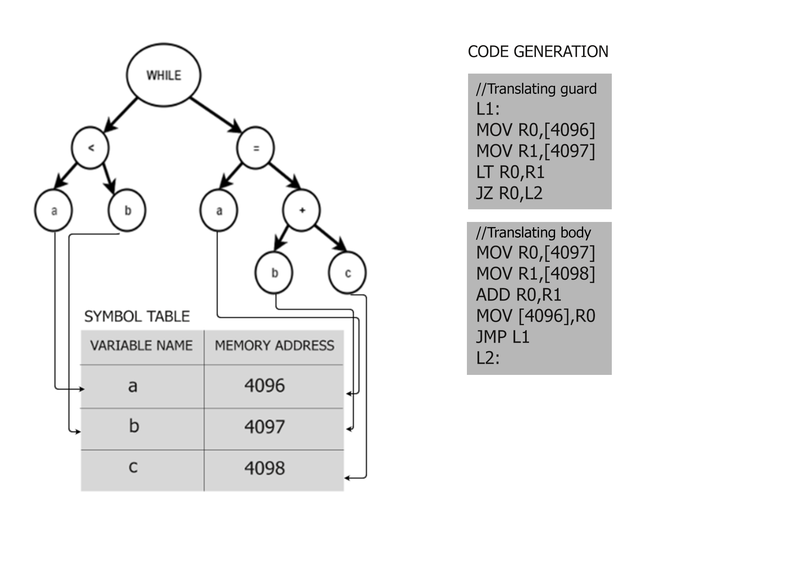

# Code Generation

## Introduction

In Code Generation step, the ExpL compiler converts the intermediate representation (the abstract syntax tree) of the ExpL program to a machine code that can be readily executed by the XSM machine.

```c
int codeGen(struct ASTNode *t, file *targetfile)
```

The codeGen() function takes as input a pointer to the root of an abstract syntax tree and a pointer to a file to which the target code has to be written. The codeGen() function generates assembly code corresponding to the program represented by the AST. The codeGen() function essentially invokes itself **recursively** to generate assembly code for the subtrees. The result of evaluation is a value which is stored in a register. The codeGen() function returns the register number that would contain the evaluated value when the assembly code is executed. (when no value results in evaluating a tree node, there is no register allocated to store the value and -1 is returned by codeGen() indicating this fact).

## Implementation

`codeGen()` function recursively generates code for each nodetype. Firstly, the code is generated for the first subtree, 'ptr1' (if not NULL) and it's value is stored in say register Ri by calling the codeGen() function with pointer to AST 'ptr1'. Similarly, code is generated for second and third subtrees 'ptr2' and 'ptr3' and results are in registers say Rj and Rk. Finally, using the registers Ri, Rj and Rk, code is generated for the current node.

Lets consider the nodetype PLUS. PLUS has two operands which are represented by subtrees 'ptr1' and 'ptr2'. Code for 'ptr1' and 'ptr2' is generated by the following instructions.

```c
i = codeGen(t->ptr1);
j = codeGen(t->ptr2);
```

Finally, the value to the current node is evaluated and saved to register Ri and Rj is freed.

```c
fprintf(); //Add this during implementation
free_register(j);
```

Following is how code is generated for the nodetype 'while'. Note that, the labels generated here are psuedo addresses. We will deal about replacing the labels with actual address in the [label translation](label-translation.md) documentation.

We have two subtrees for 'while' nodetype. 'ptr1' representing the conditional expression in while statement and 'ptr2' representing the body of while statement.

1. Get two labels using get\_label() function and write down the first label, say 'LL1' to the intermediate code, so that we can identify where exactly the code for while starts.
2. Then, the code for conditional expresssion represented by 'ptr1' is generated and value stored into a register, say Ri.
3. Next, we would check the value in Ri, if its zero, i.e, conditional expression has evaluated to false, we would jump to the end of the while code. So, the next instruction is to check if Ri is zero and jump on to second label, say LL2 where the code to the body of while statement ends.
4. If the value in register Ri is not zero, i.e, the conditional expression evaluted to true, the we would execute the body of while. Therefore, after the above steps code for 'ptr2' is generated and at the end of it, the jump statement to the first label, LL1 is given, so that, the conditional expression can be evalauted again and the decision whether to execute the body of while is made.
5. Finally the second label is given,so that we can mark the end of while statement.

For the code generation for functions, the activities are given [here.](run_data_structures/run-time-stack.md)

For making library calls, follow the steps given in the [invoking a library module](abi.md#nav-eXpOS-system-library-interface) section in [Application Binary Interface](abi.md) documentation.

## Illustration

 

Consider the ExpL program given below.

```
decl
    int a;
enddecl
int main(){
    decl
        int b;
    enddecl
    begin
        a = 1;
        b = 2;
        while(a < 10) do
            b = b + 1;
            a = a + 2;
        endwhile;
        return 1;
    end
}
```

The XSM instructions for the above while code (lines 11-12) will be as follows:

```asm
L0:
MOV R0,[4096]
MOV R1,10
LT R0,R1
JZ R0,L1
MOV R1,BP
MOV R0,1
ADD R1,R0
MOV R0,[R1]
MOV R1,1
ADD R0,R1
MOV R2,BP
MOV R1,1
ADD R2,R1
MOV [R2],R0
MOV R0,[4096]
MOV R1,2
ADD R0,R1
MOV [4096],R0
JMP L0
L1:
```
