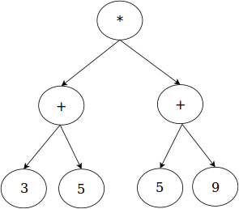
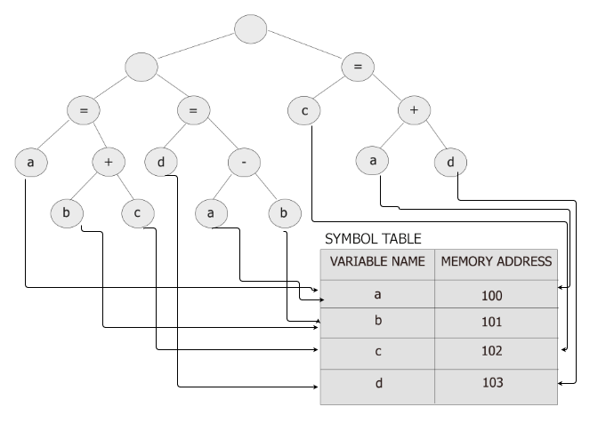

# Compile Time Data Structures

## Introduction

The compilation of an ExpL program involves two phases. In the first phase (called the **analysis phase**), the source ExpL program is analyzed (_lexical, syntax and semantic_ analysis are completed in this phase) and if the program is free of syntax and semantic errors, an _intermediate representation_ of the source program called the **abstract syntax tree** is generated.

This is followed by a second phase, the second phase (called the **synthesis phase**) recursively traverses the abstract syntax tree and generates target code.

!!! note
    In the case of an _interpreter_, the second phase (called the execution phase) involves direct execution of the program by recursive evaluation of the abstract syntax tree.

!!! note
    The abstract syntax tree representation is only one among several intermediate representations used in practical compilers. “Lower level” intermediete representations like _three address code_ are often more useful for applying code optimization algorithms. In our present experiment, we do not perform any code optimizations and hence the code generation phase will directly work with the abstract syntax tree.

There are four basic data structures that are maintained during the analysis phase. These are the following:

1. The **Type table** is used to store information regarding the primitive and user-defined types in the program.
2. The **global symbol table** is used to store information about the global variables and functions in the program.
3. For each function, a separate **local symbol table** is maintained to store the information about local variables and arguments of the function.
4. Finally, the **abstract syntax tree** is constructed as the outcome of the analysis phase.

An abstract syntax tree is a tree representation of a program. It is a generalization of the tree representation for expressions (called the expression tree). For example, the arithmetic expression (3+5)\*(5+9) is typically represented as an expression tree as below:



We can generalize this representation to come up with a tree representation for the whole sequence of statements of a ExpL function in a program. Each funcion in an ExpL program will be represented by an abstract syntax tree. Thus, the whole program will be a collection of abstract syntax trees, one for each function. As a very simple example, consider the three program statements:  

```
a = b+c;
d = a-b;
c = a+d;
```

A syntax tree representation for the three statements above would look as below:



!!! note
    The memory addresses assigned to each variable in the figure above (100-103) has been chosen arbitrary. The Application Binary Interface specifies the valid range of addresses that a compiler can allocate for variables. For instance, the ExpOS [ABI](abi.html#nav-virtual-address-space-model) requires that addresses must be in the range 4096 to 5119.

Whenever a variable occurs in the syntax tree representation, it is convenient to maintain a pointer to the symbol table entry of the variable as shown in the figure. Note that since there are multiple symbol tables (global and local), the reference maintained for each variable must be to the right symbol table containing the variable entry.

In the following, the definitions node structures for each of the above data structures is discussed. The organization of data in these data structures is also discussed with illustrative examples.

## Analysis Phase Data Structures

#### TYPE TABLE

The Type Table stores all the necessary information regarding the various user defined types in the source program. The compiler creates ...[Read more](./data_structures/type-table.md)

#### GLOBAL SYMBOL TABLE

Symbol tables are used to store information pertaining to the variables and functions in a program. The global symbol table stores information pertaining to ...[Read more](./data_structures/global-symbol-table.md)

#### LOCAL SYMBOL TABLE

In addition to the global symbol table, the ExpL compiler maintains a separate local symbol table for each function for storing information regarding ...[Read more](./data_structures/local-symbol-table.md)

#### ABSTRACT SYNTAX TREE

The machine independent front-end phase of a compiler constructs an intermediate representation of the source program called the Abstract Syntax Tree (AST). An interpreter will evaluate ...[Read more](./data_structures/abstract-syntax-tree.md)
