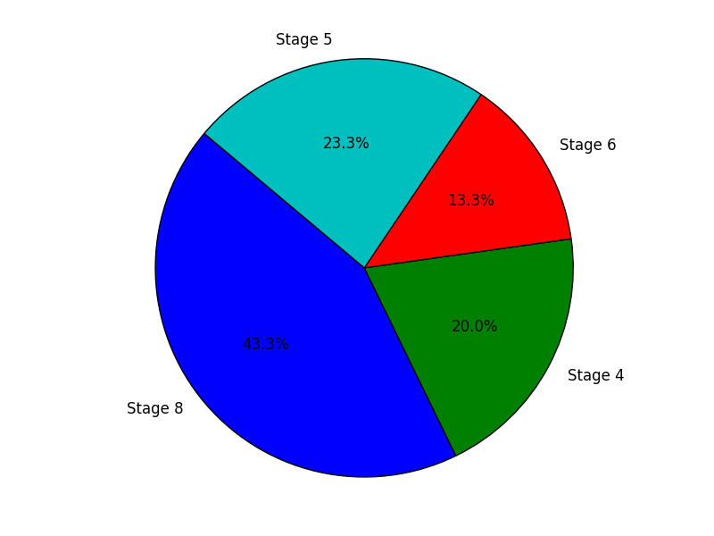

# Winter 2017, B.Tech Semester 6 Compiler Lab, NIT Calicut

**Total number of students crediting the course: 30.**  

**Duration of the course: One semester (13 weeks). Credit Units: 3**  
  
A feedback questionnaire was circulated to all the students who credited the course one week before the end of the semester. The responses are summarized below.

**Major stages of the Project** (Each Stage subsumes the previous Stages):

* Stage 4: Imperative programs without functions. Data types: variables and arrays of integer/string type.
* Stage 5: Imperative programs with functions and recursion. Data types: variables and arrays of integer/string types.
* Stage 6: Imperative programs with support for user defined types and dynamic memory allocation.
* Stage 8: Object oriented programming support for classes and single inheritance.

## Q1. _Student Performance_: How many stages of the project did you complete?

!!! note
    Every student who completed stage 7 also completed stage 8.
  
## Q2. _Time Management_: How many hours of work did you put into the project per week on an average to complete up to what you have done?

    

        
        <h5>All Students</h5>
    

    

        
        <h5>Students who finished stage 5 or above</h5>
    

## Q3. _Effectiveness of road map_: What percentage of work could be done without having to refer to material outside the roadmap/documentation of project ?

    

        
        <h5>All Students</h5>
    

    

        
        <h5>Students who finished stage 5 or above</h5>
    

## Q4: _Contribution to understanding of theory_: How much did the lab help to improve your understanding of compiler design theory?

    

        
        <h5>All Students</h5>
    

    

        
        <h5>Students who finished stage 5 or above</h5>
    

## Q5: _Contribution to Programming skills_: How far did this lab contribute to the improvement of your coding / software development skills?

    

        
        <h5>All Students</h5>
    

    

        
        <h5>Students who finished stage 5 or above</h5>
    

## Q6. _Student background_: Was your background sufficient for doing the lab ? If not, in which pre-requisite subjects did you have inadequate prior training.

    

        
        <h5>All Students</h5>
    

    

        
        <h5>Students who finished stage 5 or above</h5>
    

## Q7. _Learning experience_: Which stage gave more useful insights?.

    

        
        <h5>All Students</h5>
    

    

        
        <h5>Students who finished stage 5 or above</h5>
    

## General Observations

1. 87% of students who responded that their programming background was sufficient could complete up to Stage 5 or beyond.
2. 77% of the students who reached Stage 6 went on to complete all the stages up to Stage 8.
3. 87% of the students who completed Stage 5 or beyond noted that 90% or more of the project work can be done only by referring to the project documentation and roadmap.
4. 91% of the students who completed Stage 5 or above noted that every student with average programming skills,
    willing to put in 5-10 hours of work per week should be able to complete the first five stages of the project within one semester.
