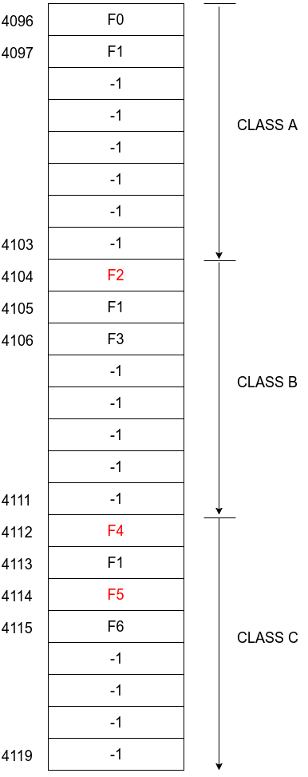

Virtual Function Table    

*   [Home](../index.html)
*   [About](../about.html)
*   [Code](#)
*   [Roadmap](../roadmap.html)
*   [Documentation](../documentation.html)

* * *

Virtual Function Table

  
  

*   [Introduction](#nav-introduction)
*   [Illustration](#nav-illustration)

Introduction
------------

This document explains how the control flow is happening from the calling object when there is inheritance,subtype polymorphism and method overriding. For a virtual function table of a class, 8 blocks of memory is allocated.

Illustration
------------

1.  Virtual function table start at 4096 in the stack, and it grows with the increase in number of the classes.  
    After creating the virtual function table, the we will allocate the space for global declarations.  
    By using the class index, the starting address in virtual function table for that particular class is known.  
    Starting at index 4096, the class index \* 8 + 4096 is the address of the current class virtual function table. The class index starts from 0.  
    For every method declaration, a new label is alloted.  
    In class A, the function f1 gets an funcposition 0 and say flabel f1 and  
    the function f2 gets an funcposition 1 and say a flabel f2.
    
    Following is how virtual function table looks in the stack when class _A_ is installed using the pointer to the member function list of class A.  
    So, the member function list of class A looks as shown in the below figure :  
      
    So, the virtual function table of class A looks as shown in the below figure. It is constructed using member function list of class A as shown in the above figure :  
    
    
2.  In class B, there are two methods f1() and f3() and it is extending class A. When a class extends other class, all the member fields and methods of the parent class are inherited by the derived class. Suppose as in this example, if the method signatures of the parent class and the derived class match, then method overriding occurs.  
    [Method Overriding](https://en.wikipedia.org/wiki/Method_overriding) means the definition of the method that belongs to parent class is replaced by the definition of the method which is already present in the derived class. Here, f1() method of class B overrides the f1() method of class A. Let us see how the process of method overriding occurrs, how the member function list is updated for the derived class. This is demonstrated using the classes B and A of this OExpL program. Here, class B is extending class A. So, all the member fields and methods of class A is inherited by class B. So, now the member function list looks as shown in the figure below.  Here method f1() derived from class A, will be overridden by the method f1() of class B. As stated above, a new label will be alloted, for the f1() method of class B. Now, we need to update the member func list entry of the f1() method in class B, by new flabel given to the method f1() of class B. Similarly, the member func list for class C will be constructed.  
    

*   [Github](http://github.com/silcnitc)
*   

Contributed By :  
[J Phani Koushik](#), [J Ritesh](#), [M Jayaprakash](#)

*   [Home](../index.html)
*   [About](../AUTHORS)