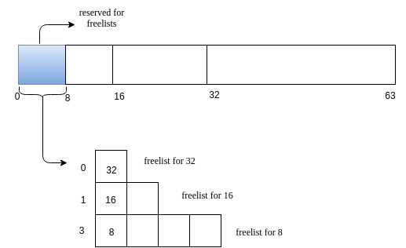
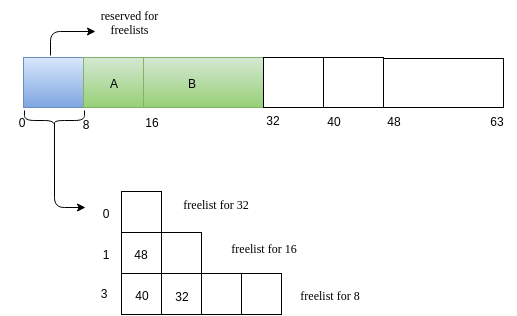
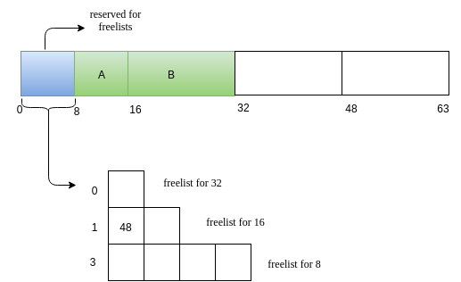

# Heap Allocation

## Introduction

ExpL specification stipulates that variables of [user defined types](../expl.html#nav-user-defined-types) are allocated dynamically using the alloc() function. The alloc() function has the following syntax:

```c
user_defined_type_var = alloc();
```

The ExpL compiler must internally determine the _allocation size_ (amount of continuous memory words) required for storing a variable of _user\_defined\_type\_var_ and must translate the requirement to a call to the Alloc() function of the [ExpL library](../abi.html#nav-eXpOS-system-library-interface).

The library function Alloc() expects three arguments - function code=2 and the allocation size. Hence, the code generated by an ExpL compiler to invoke the library for an _allocation size = 8_ may typically look like the following:


```asm
PUSH "Alloc"    //Function Code for Alloc
MOV R0, 8       //Mov the allocation_size=8 to a register
PUSH R0         //Push Argument Size
PUSH R0         //Argument 2 Empty
PUSH R0         //Argument 3 Empty
PUSH R0         //Empty space for RETURN VALUE
CALL 0          //Pass the control to virtual address 0.
```
Since the [memory model](../abi.html#nav-virtual-address-space-model) stipulates that the library is loaded to memory address zero of the address space, the library is invoked through the machine instruction CALL 0.

Similarly, memory allocated to a user defined variable may be freed by a call to the library function Free(). The library function Initialize() initializes the memory allocator of the library.

The ExpL library code, must be designed to be loaded to memory location 0 of the address space, and must be capable of processing memory allocation requests.

This document explains how the library functions must handle memory allocation and de-allocation requests.

The library allocates memory from the the **heap**. The [memory model](../abi.html#nav-virtual-address-space-model) stipulates that the heap is located between addresses 1024 and 2047 of the address space. Hence, when a memory request comes, the Alloc() function of the library must allocate sufficient memory from this memory area and return the starting address of the allocated space.

The library has three functions relating to dynamic memory management. Initialise(), Allocate() and Free(). The Initialise() function sets up the heap data structures initially. Each memory request is processed by Alloc() and Free() de-allocates a previously allocated memory block.

In the following we discuss two sets of algorithms for implementing these functions. First we will describe a **simple fixed size allocator** assuming that the Alloc() function always allocates a fixed sized memory block irrespective of the allocation size of the request. Such allocation, however is possible only if the maximum size of a request is known in advance. Later we describe the **buddy system allocator** which can handle requests of arbitrary size subject to a maximum limit.

## Fixed Memory Allocation

In this algorithm, the chunk size allocated is fixed. Lets call the fixed size as HB\_SIZE, say 8. The heap is considered here as a list of blocks of HB\_SIZE.

!!! note
    Since the member fields of user-defined-type variables are allocated space in the heap, when fixed block size allocation is done,
    a user defined type variable must not be permitted to have more than `HB_SIZE` member fields.
    The compiler must flag error if a type definition with more than `HB_SIZE` member fields is encountered.

The first block in the list is reserved. Initially, the first index of reserved block stores the index of first free block. The first index of every free block stores the index of next available free block. The last block stores -1 in the first index. This is how it looks initially(after the call to initialize() function).


Following is the **allocation algorithm.**

1.  First index of reserved block is checked, let the value be v.
2.  If v is -1,  
       return -1 indicating no free blocks are available.
3.  Else,  
       allocate the free block at v,  
       copy the next free block index stored at v to the reserved block. Return v.

Following is the **deallocation algorithm.**

1.  The argument passed : starting address of the block(say s) to be deallocated
2.  The block s is cleared.
3.  The value in the first index of reserved block is copied to first index of block s.
4.  The first index of reserved block is set with starting address of block s.

### Illustration

This section shows how the heap looks after each step of allocation or free. This is for the better understanding of the algorithms.

*   x = alloc();

    

*   y = alloc();
    
    

*   z = alloc();
    
    

*   dealloc(x);
    
    

*   dealloc(z);
    
    

*   z = alloc();
    
    

## Buddy Memory Allocation (_optional_)

In this technique, memory is divided into partitions to try to satisfy a memory request as suitably as possible.
This technique makes use of splitting memory into halves to give a best-fit.

Every memory block in this technique has an order, a number ranging from 0 to a specified upper limit.
The size of block of order n is 2<sup>n</sup>. So the blocks are exacly twice the size of blocks of one order lower.
Power-of-two block sizes makes address computation simple, because all buddies are aligned on memory address boundaries
that are powers of two. When a larger block is split, it is divided into two smaller blocks,
and each smaller block becomes a unique **buddy** to the other. A split block can only be merged with its unique buddy
block, which then reforms the larger block they were split from.

Starting off, the size of the smallest possible block is determined, i.e. the smallest memory block that can be allocated.
The smallest block size is then taken as the size of an order-0 block, so that all higher orders are expressed as
power-of-two multiples of this size. In our implementation, we consider the smallest memory block size to be 8. So,
the memory block sizes will be 8, 16, 32, 64, and so on. In our implementation, we take the heap of size 1024.

In our implementation, we have a heap of size 1024. The smallest block size possible in the heap is 8 (order 0).
The highest block size of 2<sup>n</sup> that is free is 1024. We maintain a free list for all possible block sizes.
So we have freelists for sizes 8, 16, 32, 64, 128, 256, 512 and 1024, i.e, we maintain eight freelists.

*   We have only one block of size 1024 and so the size of freelist for 1024 is 1(2<sup>0</sup>).
*   In the 1024 sized heap, we have two blocks of size 512, starting at 1024 and 1536 respectively (heap starts at 1024). Note that, both blocks cannot be free at the same time. If both blocks are free, they will be merged to a free block of size 1024(whose information will be maintained in the freelist for blocks of 1024 size). So at a time, maximum number of blocks that are free of size 512 is 1 ( 2<sup>0</sup>).
*   Similarly in case of blocks of size 256, 1024 sized heap has 4 blocks of size 256, starting at 1024, 1280, 1536 and 1792 (say a,b,c and d in their respective order).
    a and b are buddies of each other, of which both cannot be free at a time due to merging, so only one of them can be free.
    Similarly in case of c and d, only one of them can be free. 1 + 1 , 2 ( 2<sup>1</sup>) is the maximum size of free list for blocks of 256.
*   Similarly, there are 8 blocks of 128 in 1024 (a,b,c,d,e,f,g and h). (a,b)(c,d)(e,f)(g,h) are buddy pairs and only one of each pair can be free.
    So the maximum size of freelist for blocks of 128 is 4 ( 2<sup>2</sup>).
*   Similarly, the maximum size of freelist for blocks of sizes 64,32,16 and 8 are 8 ( 2<sup>3</sup>),16( 2<sup>4</sup>),32( 2<sup>5</sup>) and 64( 2<sup>6</sup>) respectively.

So, the size of the complete freelist is 2<sup>0</sup> + 2<sup>0</sup> + 2<sup>1</sup> + 2<sup>2</sup> + 2<sup>3</sup> + 2<sup>4</sup> + 2<sup>5</sup> +2<sup>6</sup> = 128.

We will maintain the **freelist** inside the heap, So initially we won't have the complete heap of 1024 free. We need not require a freelist for size 1024. We will store the complete freelist in a 128 sized block. Therefore, initially we have the first 128 block(0-127) of the heap reserved for freelist maintainence. Then we have a 128 sized free block(128-255), then a 256 block(256-511) and then a free block of 512 size(512-1023). Following is the diagrammatic representation of the heap initial status.


The free-list in the heap has to be initialised as above. Also, the first index of each allocated block through alloc function will store the size of allocated block. This is to figure out the size that has been allocated when the dealloc function is called for a variable, which provides only the starting address of the block that has been allocated.

Following is the **allocation algorithm** : (argument : Request for a block of size 'A')

*   Look for a memory slot of suitable size(i.e, the **minimal 2<sup>k</sup> block** that is larger or equal to that of the requested memory A + 1, a plus one as first index is used to store the size of block allocated), lets call the ceiled size as 'B'.
    1.  If found, the starting index of the allocated block is returned to the program after removing it from the freelist.
    2.  If not, it tries to make a suitable memory slot by following the below steps
        1.  Split a the **next larger suitable free memory slot** into half.(Remove the next larger suitable free memory slot from it free list and add both the halves to the corresponding freelist).(Note : of there is no larger free memory slot - return -1 indicating that no free space is available).
        2.  If the required size 'B' is reached, one of the halves is allocated to the program.
        3.  Else go to the step a and repeat it until the memory slot of required size 'B' is found.

Following is the **deallocation algorithm** (argument : the starting address of the allocated block)

1.  Get the size, say 's' of the block from the first index of the block. Free the complete block.
2.  Check if the buddy of the block is free by checking the whether the buddy's starting address is present in the free list for blocks of size 's' .
3.  If the buddy is not free, add the current freed block to its free list.
4.  If the buddy is free, remove the buddy from the freelist and combine the two, and go back to step 2 to check for the buddy of merged block. Repeat this process until the upper limit is reached or buddy is not free.

### Illustration

For a better understanding purpose, we will have a simple illustration of how heap memory looks like through a set of some allocations and deallocations.

For illustration, we will have 64-sized heap and smallest block size as 8. So we free lists for sizes 8,16 and 32 of lengths 4 ,2 and 1. So we will use a 8-size block to store the free-list.

1.  The heap looks initially as follows.
    
    

2.  Request for memory of size 5. Lets call this request as A. The nearest 2^k value for 5 is 8. We search for a 8 sized free block. We have one such! Allocate it!
    
      
    
3.  Next we will have a reuqest B of size 14.
    
      
    
4.  Now we have a request C of size 7.
    
      
      
      
    
5.  Now, C releases its memory.
    
      
      
      
    
